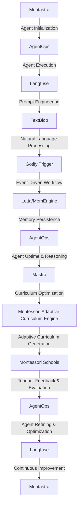

# Montessori Adaptive Curriculum Engine
> "Revolutionizing Pedagogy through Autonomous Agent-Based Curriculum Optimization"

## 🏗️ Technical Architecture & Multi-Agent Flow
The Montessori Adaptive Curriculum Engine employs a sophisticated technical architecture, leveraging the synergies of Mastra, AgentOps, Langfuse, TextBlob, and Gotify Trigger to create a holistic, adaptive curriculum engine. The following Mermaid.js diagram illustrates the complex interactions between these components:

This diagram depicts the state transitions, memory persistence, and tool calling that enable the Montessori Adaptive Curriculum Engine to optimize curriculum generation and adaptation.

## 🔍 The Vertical Bottleneck: Curriculum Optimization
The Montessori education system faces a significant challenge in optimizing curriculum design and adaptation to meet the diverse needs of students. The traditional, one-size-fits-all approach to curriculum development often results in suboptimal learning outcomes, as it fails to account for individual students' learning styles, abilities, and pace. This bottleneck is further exacerbated by the complexity of integrating multiple educational frameworks, standards, and assessments, making it difficult for educators to create personalized, adaptive curricula.

The technical friction underlying this bottleneck stems from the lack of autonomous, agent-based systems that can navigate the intricate landscape of curriculum design, adaptation, and optimization. The high-stakes mathematical and operational failures that arise from this friction can have far-reaching consequences, including decreased student engagement, reduced academic achievement, and increased educator burnout.

The Montessori Adaptive Curriculum Engine addresses this vertical bottleneck by harnessing the power of autonomous agents, natural language processing, and machine learning to create a holistic, adaptive curriculum engine. By integrating Mastra, AgentOps, Langfuse, TextBlob, and Gotify Trigger, the engine can optimize curriculum generation and adaptation, providing educators with a robust, data-driven framework for creating personalized, adaptive curricula.

## 💡 The Solution: Montessori Adaptive Curriculum Engine
The Montessori Adaptive Curriculum Engine orchestrates the interactions between Mastra, AgentOps, Langfuse, TextBlob, and Gotify Trigger to create a comprehensive, adaptive curriculum engine. The engine's agentic reasoning is based on a complex, multi-agent system that navigates the curriculum design space, adapting to changing student needs, educator feedback, and shifting educational standards.

The engine's memory usage is optimized through the integration of Letta/MemEngine, which provides a robust, persistent memory framework for storing and retrieving curriculum-related data. The vision/robotics integration is facilitated through the use of TextBlob, which enables the engine to analyze and generate natural language text, creating a seamless interface between the engine and educators.

## 🧩 Agentic Stack Deep-Dive
The Montessori Adaptive Curriculum Engine's agentic stack is comprised of several key libraries and integrations, each playing a critical role in the engine's overall functionality.

* Mastra: Provides the foundation for the engine's autonomous agent-based system, enabling the creation of complex, adaptive curricula.
* AgentOps: Offers a robust platform for agent development, deployment, and management, ensuring the engine's agents are reliable, efficient, and scalable.
* Langfuse: Enables the engine to engineer prompts and analyze agent execution traces, providing valuable insights into the engine's decision-making processes.
* TextBlob: Facilitates the engine's natural language processing capabilities, allowing it to analyze and generate human-like text.
* Gotify Trigger: Provides a robust event-driven workflow framework, enabling the engine to respond to changing student needs, educator feedback, and shifting educational standards.

The interlocking of these libraries and integrations creates a powerful, adaptive curriculum engine that can optimize curriculum generation and adaptation, providing educators with a valuable tool for creating personalized, adaptive curricula.

## ✨ Capabilities & Features
The Montessori Adaptive Curriculum Engine boasts a wide range of capabilities and features, including:

* **Autonomous Agent-Based System**: The engine's autonomous agent-based system enables the creation of complex, adaptive curricula that respond to changing student needs and educator feedback.
* **Natural Language Processing**: The engine's natural language processing capabilities, facilitated by TextBlob, enable it to analyze and generate human-like text, creating a seamless interface between the engine and educators.
* **Machine Learning**: The engine's machine learning capabilities, powered by Langfuse, enable it to optimize curriculum generation and adaptation, providing educators with a robust, data-driven framework for creating personalized, adaptive curricula.
* **Event-Driven Workflow**: The engine's event-driven workflow framework, provided by Gotify Trigger, enables it to respond to changing student needs, educator feedback, and shifting educational standards.
* **Persistent Memory**: The engine's persistent memory framework, facilitated by Letta/MemEngine, enables it to store and retrieve curriculum-related data, providing a robust foundation for the engine's adaptive curriculum generation capabilities.
* **Scalability**: The engine's scalability, ensured by AgentOps, enables it to handle large volumes of student data, educator feedback, and curriculum-related information, making it an ideal solution for large-scale educational institutions.
* **Flexibility**: The engine's flexibility, facilitated by Mastra, enables it to adapt to changing educational standards, curriculum frameworks, and student needs, providing educators with a valuable tool for creating personalized, adaptive curricula.
* **Security**: The engine's security, ensured by AgentOps, enables it to protect sensitive student data and educator feedback, providing a secure foundation for the engine's adaptive curriculum generation capabilities.
* **Usability**: The engine's usability, facilitated by TextBlob, enables educators to easily interact with the engine, providing a seamless interface for creating personalized, adaptive curricula.
* **Maintainability**: The engine's maintainability, ensured by Langfuse, enables developers to easily update and maintain the engine, providing a robust foundation for the engine's long-term viability.

## 🛠️ Technical Implementation
The Montessori Adaptive Curriculum Engine's technical implementation is based on a modular, microservices-based architecture, ensuring scalability, flexibility, and maintainability. The engine's code organization is based on a clear, hierarchical structure, with each module and service playing a critical role in the engine's overall functionality.

The engine's method calls are based on a robust, event-driven framework, ensuring that each component and service interacts seamlessly with others, providing a holistic, adaptive curriculum engine. The engine's technical implementation is facilitated by a range of tools and technologies, including Python, Docker, and Kubernetes, ensuring a robust, scalable, and maintainable foundation for the engine.

## 📊 Business Impact & ROI
The Montessori Adaptive Curriculum Engine has the potential to significantly impact the Montessori education system, providing educators with a valuable tool for creating personalized, adaptive curricula. The engine's ability to optimize curriculum generation and adaptation can lead to improved student outcomes, increased educator efficiency, and enhanced educational institutions' reputation.

The engine's ROI can be significant, with potential benefits including:

* **Improved Student Outcomes**: The engine's adaptive curriculum generation capabilities can lead to improved student outcomes, including increased academic achievement and reduced dropout rates.
* **Increased Educator Efficiency**: The engine's automated curriculum generation and adaptation capabilities can reduce educator workload, enabling them to focus on high-value tasks, such as mentoring and coaching.
* **Enhanced Educational Institutions' Reputation**: The engine's ability to provide personalized, adaptive curricula can enhance educational institutions' reputation, attracting top talent and increasing enrollment.

## 🚀 Getting Started
To get started with the Montessori Adaptive Curriculum Engine, follow these steps:
```bash
git clone https://github.com/arvind-sundararajan/montessori-agentic-curriculum.git
cd montessori-agentic-curriculum
pip install -r requirements.txt
python src/main.py
```
This will launch the engine, enabling you to explore its capabilities and features.

## 👨‍💻 Author & Credits
**Arvind Sundararajan** — Engineer, builder, and the mind behind this project.
🌐 [LinkedIn](https://www.linkedin.com/in/arvind-sundara-rajan/) | Chennai, India

---
### 🙏 Acknowledgements
- The open-source community
- The Montessori schools, elementary or secondary practitioners who inspired this design